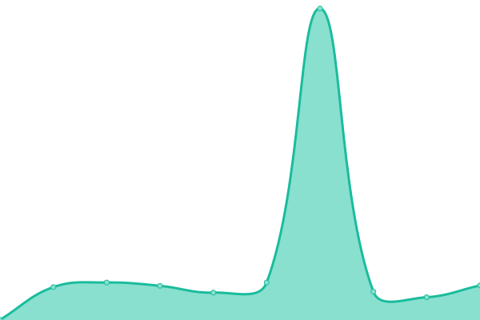

# [📈 Live Status](https://matchID-project.github.io/uptime): <!--live status--> **🟥 Complete outage**

This repository contains the open-source uptime monitor and status page for [matchID project](https://matchID-project.github.io), powered by [Upptime](https://github.com/upptime/upptime).

With [Upptime](https://upptime.js.org), you can get your own unlimited and free uptime monitor and status page, powered entirely by a GitHub repository. We use [Issues](https://github.com/matchID-project/uptime/issues) as incident reports, [Actions](https://github.com/matchID-project/uptime/actions) as uptime monitors, and [Pages](https://matchID-project.github.io/uptime) for the status page.

<!--start: status pages-->
<!-- This summary is generated by Upptime (https://github.com/upptime/upptime) -->
<!-- Do not edit this manually, your changes will be overwritten -->
<!-- prettier-ignore -->
| URL | Status | History | Response Time | Uptime |
| --- | ------ | ------- | ------------- | ------ |
|  [www.matchid.io](https://www.matchid.io) | 🟥 Down | [www-matchid-io.yml](https://github.com/matchID-project/uptime/commits/HEAD/history/www-matchid-io.yml) | 

 140ms
     
 | 

<a href="https://uptime.matchid.io/history/www-matchid-io">0.39%</a>
    

|  [deces.matchid.io website](https://deces.matchid.io) | 🟥 Down | [deces-matchid-io-website.yml](https://github.com/matchID-project/uptime/commits/HEAD/history/deces-matchid-io-website.yml) | 

 82ms
     
 | 

<a href="https://uptime.matchid.io/history/deces-matchid-io-website">0.39%</a>
    

|  [deces.matchid.io search API](https://deces.matchid.io/deces/api/v1/search?q=pompidou) | 🟥 Down | [deces-matchid-io-search-api.yml](https://github.com/matchID-project/uptime/commits/HEAD/history/deces-matchid-io-search-api.yml) | 

 21ms
     
 | 

<a href="https://uptime.matchid.io/history/deces-matchid-io-search-api">0.39%</a>
    

|  [dev-deces.matchid.io website](https://dev-deces.matchid.io) | 🟥 Down | [dev-deces-matchid-io-website.yml](https://github.com/matchID-project/uptime/commits/HEAD/history/dev-deces-matchid-io-website.yml) | 

 84ms
     
 | 

<a href="https://uptime.matchid.io/history/dev-deces-matchid-io-website">0.39%</a>
    

|  [dev-deces.matchid.io search API](https://dev-deces.matchid.io/deces/api/v1/search?q=pompidou) | 🟥 Down | [dev-deces-matchid-io-search-api.yml](https://github.com/matchID-project/uptime/commits/HEAD/history/dev-deces-matchid-io-search-api.yml) | 

 23ms
     
 | 

<a href="https://uptime.matchid.io/history/dev-deces-matchid-io-search-api">0.39%</a>
    

<!--end: status pages-->

[**Visit our status website →**](https://matchID-project.github.io/uptime)

## 📄 License

- Powered by: [Upptime](https://github.com/upptime/upptime)
- Code: [MIT](./LICENSE) © [matchID project](https://matchID-project.github.io)
- Data in the `./history` directory: [Open Database License](https://opendatacommons.org/licenses/odbl/1-0/)
